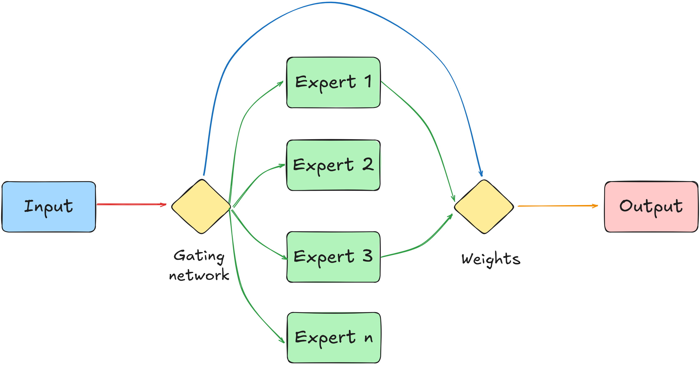

# Custom Sparse Mixture-of-Experts (MoE) for Nuanced Sentiment Analysis on Persian Restaurant Reviews

## 📄 Abstract
State-of-the-art Natural Language Processing (NLP) often demands massive computational resources. Mixture-of-Experts (MoE) architectures address this by activating specialized sub-networks conditionally per token, thereby keeping computational costs constant while scaling capacity. This repository presents a comprehensive, from-scratch implementation of a **Sparse MoE Network** in PyTorch for sentiment analysis. Utilizing a novel dataset of **70,000 Persian restaurant reviews** scraped from SnappFood via a custom-built data pipe (`DataCollector.py`), we explore the token routing dynamics, the implementation of a load-balancing auxiliary loss, and the explicit semantic specialization developed by individual experts. 

---

## 1. Introduction & Motivation
Persian sentiment analysis, particularly in food-delivery contexts, poses severe linguistic challenges. Reviews contain heavily colloquial structures, overlapping sentiment targets, and high syntactic diversity. 

Traditional dense architectures process all inputs through identical weights, leading to parameter interference when learning distinct concepts. This research utilizes a **Sparse MoE approach** where a gating network dynamically assigns tokens to a set of specialized Feed-Forward Neural Networks (Experts). This allows the network to partition the complex linguistic space of Persian slang and formal text efficiently without increasing the computational footprint per token.

---

## 2. Dataset & Preprocessing Pipeline
The empirical foundation of this project is a dataset comprising **70,000 text reviews** extracted from the SnappFood platform.

### 2.1 Extraction
Data collection was automated via `DataCollector.py`, implementing robust scraping loops, handling rate limits, and structuring the raw JSON responses into tabular data.

### 2.2 Text Normalization & Challenges
Persian text requires meticulous preprocessing due to structural variations:
- **Bi-directional Rendering:** Handled via `python-bidi` and `arabic_reshaper` to guarantee accurate RTL (Right-to-Left) processing and visual token integrity during logging.
- **Tokenization & Cleaning:** Non-alphanumeric noise, URLs, and repetitive punctuation were filtered, leaving native Persian tokens while carefully preserving critical sentiment-bearing emojis.

---

## 3. Architecture & Methodology
The implemented architecture consists of an Embedding layer, a custom Gating Network, a bank of Parallel Experts, and a Classification head.



### 3.1 Sparse MoE Layer Mechanics
Given an input vector $x$, the output of the MoE layer is governed by the following formulation:

$$y = \sum_{i=1}^{N} G(x)_i E_i(x)$$

Where:
- $N$ is the total number of experts.
- $E_i(x)$ is the non-linear output of the $i$-th expert network.
- $G(x)_i$ is the gating coefficient for the $i$-th expert, satisfying $\sum G(x)_i = 1$.

To enforce sparsity (activating only the top $k$ experts), a Top-$k$ gating mechanism with trainable gating weights $W_g$ is used:

$$G(x) = \text{Softmax}(\text{TopK}(W_g \cdot x, k))$$

### 3.2 The Load-Balancing Auxiliary Loss
A critical failure mode of MoE architectures is **router collapse**, where the gating network repeatedly selects a few dominant experts, leaving others un-trained and idle. To mitigate this, an **Auxiliary Loss ($L_{aux}$)** was integrated alongside the primary Cross-Entropy Loss:

$$L_{total} = L_{cross\_entropy} + \alpha \cdot L_{aux}$$

The auxiliary loss calculates the square of the coefficient of variation of the expert gating probabilities across the batch, heavily penalizing unequal distribution of workloads and forcing the router toward uniform expert utilization.

---

## 4. Interpretability & Expert Specialization
A standalone feature of this implementation is the empirical tracking of token allocation using the `discover_expert_specialties` subroutine. By auditing the valid/test loops, we extract the top keywords routed to each expert.

---

## 5. Repository Structure
- `DataCollector.py`: Custom scrapper and text compiler for SnappFood reviews.
- `MainNotebook.ipynb`: End-to-end training pipeline, MoE layers, and visualizations.
- `requirements.txt`: Pinned python dependencies for full reproducibility.

---

## 6. Replication Manual

### Installation
Clone the repository and install the verified environment:
```bash
git clone [https://github.com/sadraaa444-glitch/SnappFood-MoE-Sentiment-Analysis.git](https://github.com/sadraaa444-glitch/SnappFood-MoE-Sentiment-Analysis.git)
cd SnappFood-MoE-Sentiment-Analysis
pip install -r requirements.txt
```

### Dataset and Execution
1. Run `DataCollector.py` to compile the 70,000 reviews dataset.
2. Fire up your Jupyter environment and open `MainNotebook.ipynb`.
3. Execute all cells to witness the data preprocessing, model initialization, custom training loop dynamics, and routing analysis.

---
*Developed by Sadra Amiri*